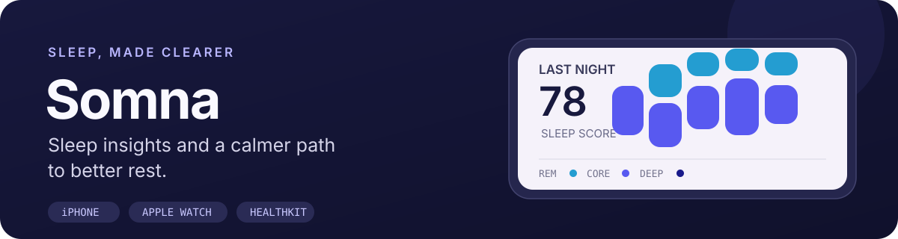
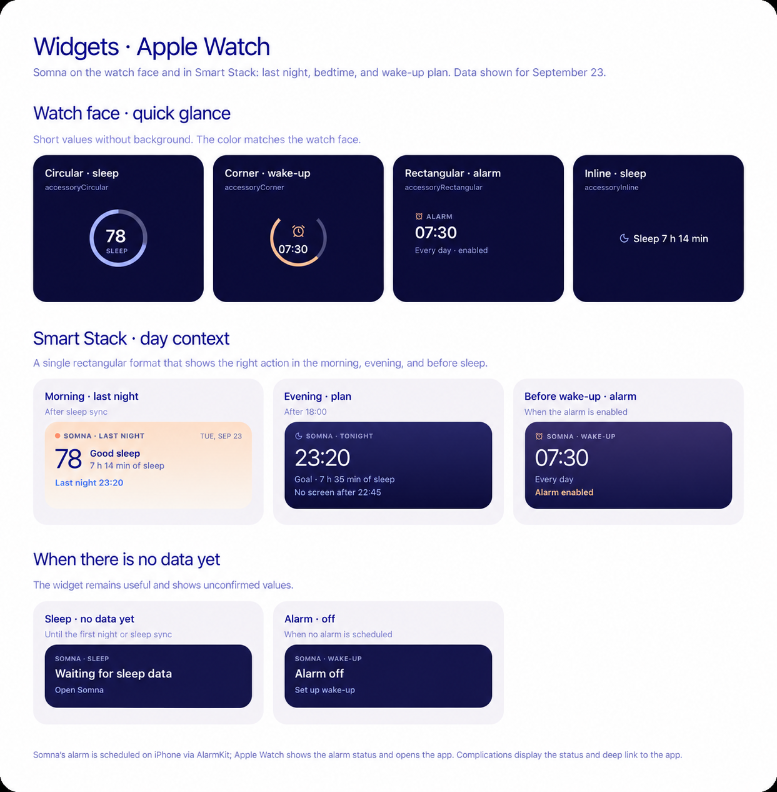
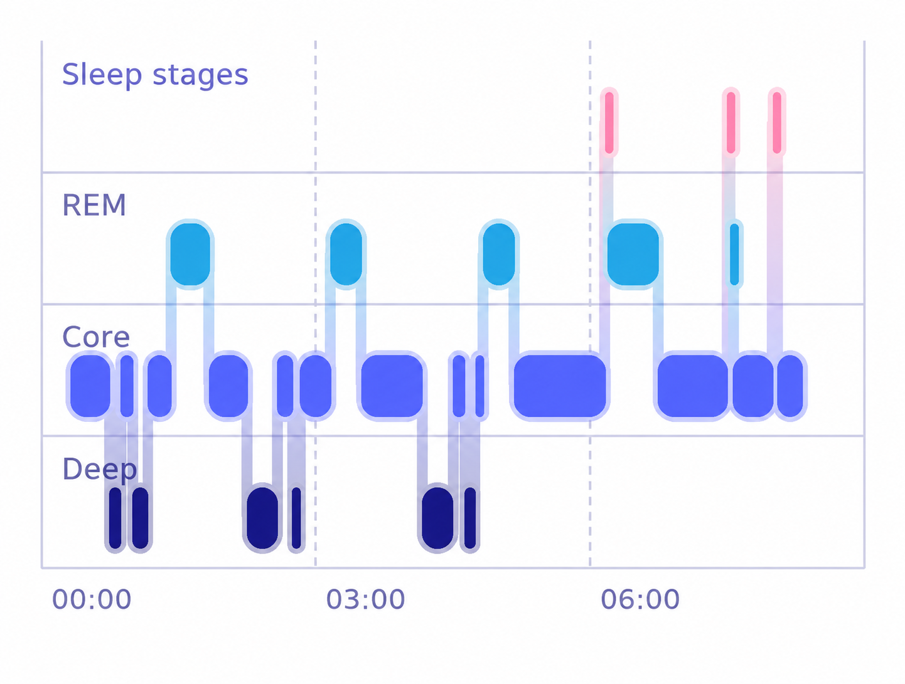

<p align="center">
  
</p>

<p align="center">
  <a href="https://github.com/Hqzdev/Somna"></a>
  <a href="https://developer.apple.com/xcode/"></a>
  <a href="LICENSE"></a>
</p>

Somna turns Apple Health sleep data into a simple nightly review, a practical plan for tonight, and a steady wake-up routine. The iPhone app, Apple Watch app, and widgets share one view of the day and night.

> Somna is an early-stage personal project. Screens below are design previews; behavior and availability may change.

## A look at Somna

<p align="center">
  
</p>

<p align="center">
  
</p>

## What it does

- **Review your night.** Read sleep duration, sleep stages, and a sleep score based on available Health data.
- **Plan the evening.** Set a bedtime routine and wake time, then keep the plan close with iPhone and Apple Watch widgets.
- **Keep the alarm in sync.** Configure the AlarmKit alarm on iPhone and view its time and status on Apple Watch.
- **Learn from your journal.** Track daily habits alongside sleep and explore patterns without treating correlation as proof of cause.
- **Keep data on device.** Somna reads Apple Health data with permission and stores its app data locally.

## Project status

Somna is under active development. The screenshots are design previews, and some screens or integrations may still be evolving. Health data is available only after the user grants access and the device has relevant records. Alarm behavior depends on system support and the user's authorization.

## Build from source

### Requirements

- macOS with Xcode 27 or later
- iOS 27 SDK for the iPhone app
- A paired Apple Watch for testing watchOS features on hardware

### Open the project

```sh
git clone https://github.com/Hqzdev/Somna.git
cd Somna
open Somna/Somna.xcodeproj
```

In Xcode, choose the `Somna` scheme to run the iPhone app or `SomnaWatch` to run the watch app. Select a simulator or a paired device, choose a development team under **Signing & Capabilities**, and press **Run**. The first launch may ask for Apple Health and alarm permissions.

## How it is built

- **SwiftUI** for the iPhone and Apple Watch interfaces
- **HealthKit** for sleep and related health records
- **WidgetKit** for iPhone widgets and Apple Watch complications
- **WatchConnectivity** for sharing the current Somna snapshot with the paired watch
- **AlarmKit** for the iPhone wake-up alarm

## Contributing

Issues and pull requests are welcome. Please read [CODE_OF_CONDUCT.md](CODE_OF_CONDUCT.md) before participating. Keep changes focused, describe how they were checked, and avoid including real health data in screenshots or examples.

## License

Somna is available under the [MIT License](LICENSE).
